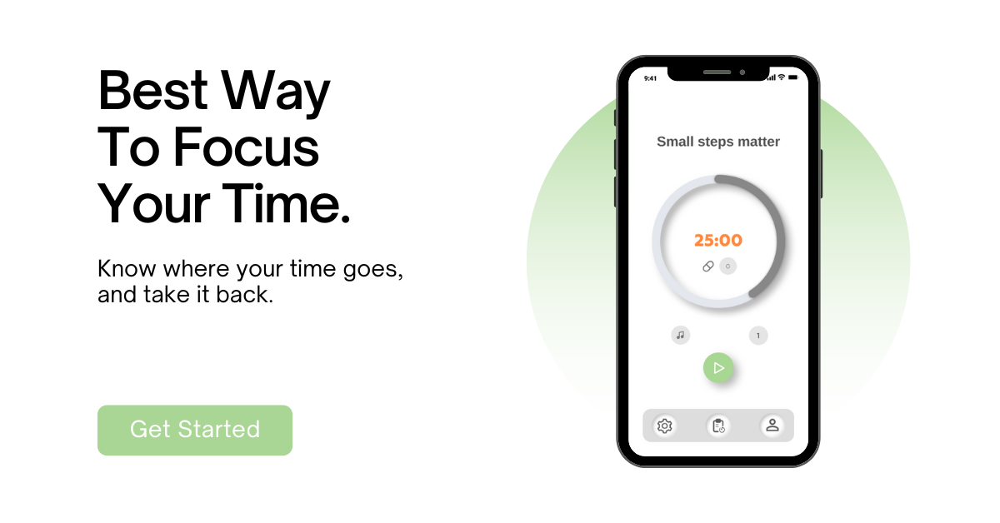
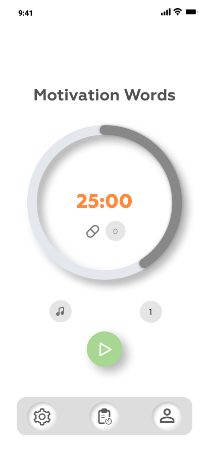

# Focus Capsules – تطبيق كبسولات التركيز ⏱️💊

  

**مدة العمل على المشروع:** مارس 2022 – مايو 2022  

---

## 💡 فكرة المشروع

تطبيق يساعد على إدارة الوقت وتحسين التركيز باستخدام أسلوب الكبسولات، وهو نمط مشابه لتقنية Pomodoro لكنه بلمسة خاصة.  
يقوم المستخدم بضبط عدد كبسولات التركيز وفترات الراحة، ويتم تتبع التقدم عبر تقارير دورية.

---

## 📱 المميزات

- مؤقت لجلسات التركيز مع وضعيتين:  
  - العد التنازلي (Count Down)  
  - العد التصاعدي (Count Up)
- إمكانية تشغيل المؤقت في الخلفية أثناء استخدام تطبيقات أخرى.
- تسجيل دخول وتغيير كلمة المرور.
- شاشة تقارير يومية، أسبوعية، وشهرية لعدد الكبسولات.
- تصميم عصري بسيط يحفز المستخدم على الاستمرار.

---

## 🛠️ التقنيات المستخدمة

- Flutter
- Dart
- Firebase Authentication (لتسجيل الدخول)
- Background Timer Logic
- Figma (لتصميم الواجهة)

---

## 📸 صور من التطبيق

### شاشة إعداد المؤقت (Timer Setting)

  

### شاشة جلسة التركيز (Motivation Words)

  

---

## 🔍 التحديات

- تشغيل المؤقت في الخلفية دون توقف أو إعادة ضبط.
- تصميم تجربة مستخدم تحفز على الاستمرارية.
- إدارة الجلسات وربطها بتقارير لحساب الإنتاجية.

---

## 📎 ملاحظات

> **⚠️ الكود المصدري غير متاح حاليًا** بسبب فقدان الملفات من الجهاز.  
> هذا المستودع يستخدم فقط لعرض فكرة المشروع والتصميم.

---

## 🤝 تواصل

لو حابب تعرف أكتر عن المشروع أو تنفذ فكرة مشابهة، [LinkedIn](https://www.linkedin.com/in/ansbedoor)

